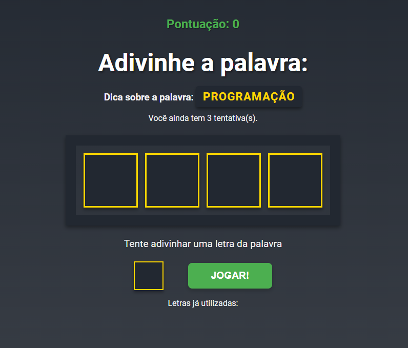

# Secret Word 🎮🤔

Bem-vindo ao **Secret Word**! Este é um jogo simples e divertido desenvolvido em **React.js**, onde o jogador tenta adivinhar palavras sorteadas letra por letra. A cada acerto, o jogador soma pontos, mas cuidado: você só tem **três tentativas** para errar!



## 🚀 Funcionalidades

- 🎯 **Advinhe a palavra**: O jogo sorteia uma palavra aleatória, e o jogador tenta acertar as letras.
- 💡 **Dicas visuais**: É exibido a categoria da palavra como dica e também número de letras. As letras corretas são reveladas conforme o jogador acerta.
- ❤️ **Três tentativas**: O jogador tem três chances de errar. Ao zerar as tentativas, o jogo finaliza.
- 🏆 **Pontuação**: A cada palavra correta, são somados **100 pontos** ao total.
- 🎮 **Reinício automático**: Após cada palavra finalizada, o jogo sorteia uma nova palavra para continuar jogando.

## 🖥️ Tecnologias Utilizadas

- **React.js**: Toda a interface e lógica do jogo foram construídas usando a biblioteca React.

## 📦 Instalação

Siga os passos abaixo para rodar o projeto localmente:

1. Clone o repositório:
   ```bash
   git clone https://github.com/seuusuario/secret-word.git
2. Acesse o diretório do projeto:
   ```bash  
   cd secret-word

3. Instale as dependências:
   ```bash  
   npm install

4. Rode o projeto:
   ```bash   
   npm run dev

📄 Licença
Este projeto é distribuído sob a licença MIT. Veja o arquivo LICENSE para mais detalhes.
